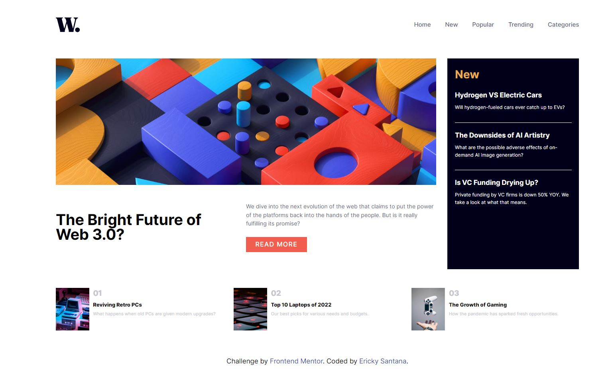
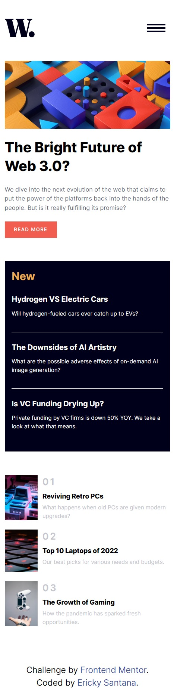
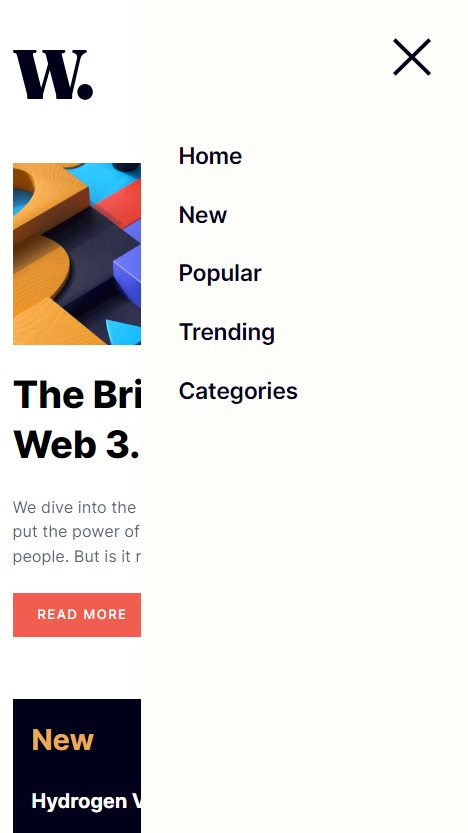

# Frontend Mentor - News homepage solution

This is a solution to the [News homepage challenge on Frontend Mentor](https://www.frontendmentor.io/challenges/news-homepage-H6SWTa1MFl).

## Tabela de Conteúdos

- [Overview](#overview)
  - [Screenshot](#screenshot)
  - [Links](#links)
- [My process](#my-process)
  - [Built with](#built-with)
  - [What I learned](#what-i-learned)
  - [Continued development](#continued-development)
- [Author](#author)

## Overview

### Screenshot

#### Desktop

#### Mobile

#### Mobile Menu

### Links

- Solution URL: [Github - News HomePage](https://github.com/erickystn/new-homepage)
- Live Site URL: [Vercel](https://new-homepage-xi.vercel.app/)

## My process

### Built with

- Semantic HTML5 markup
- CSS custom properties
- Flexbox
- Mobile-first workflow
- Vanilla CSS
- Javascript

### What I learned

In this challenge, I managed to remember some good CSS styling practices and made the code less verbose by separating parts of the CSS to improve readability. I also merged sections that shared code to avoid unnecessary duplication, and used javascript to make a mobile menu work.

### Continued development

I plan to continue to challenge myself by not only continuing my studies, but also putting all the knowledge I have gained into practice, especially on more complex projects. I might even consider using a CSS superset along the way. I'm also looking forward to improving my Javascript skills.

## Author

- Website - [Ericky GitHub](https://github.com/erickystn/)
- Frontend Mentor - [@erickystn](https://www.frontendmentor.io/profile/erickystn)
